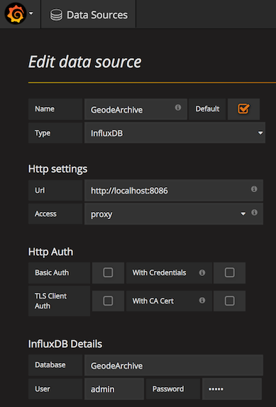
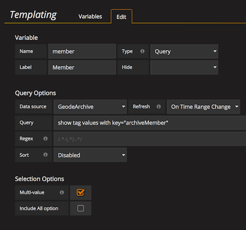
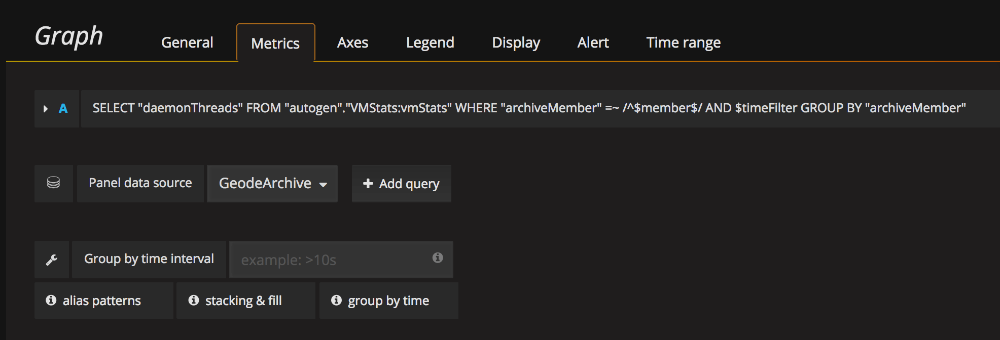

# Analyse Apache Geode & GemFire Statistics With Grafana

[Apache Geode](http://geode.apache.org/) can collect [Statistics](http://geode.apache.org/docs/guide/managing/statistics/chapter_overview.html) about the distributed system and persist it in archive files. The `StatisticsToGrafana` tool helps to load the archive files in time-series databases such as InfluxDB used to feed [Gfafana](http://grafana.org/) dashboards. 
Use the stack to build comprehensive [Gfafana](http://grafana.org/) dashboards to visualize, analyse and compare statistics data from different cluster members or even different Geode clusters.

## Build
Get the source code from github
```
git clone https://github.com/tzolov/geode-dashboard.git
```

From within the geode-dashboard/statistics-to-grafana directory run
```
mvn clean install
```

## Quick Start
Build Grafana dashboard to analyze the statistics files collected on two Geode instances (e.g. members). 
[Grafana](http://docs.grafana.org/installation) and [InfluxDB](https://docs.influxdata.com/influxdb/v1.1/introduction/installation) have to be installed first. Samples below expect InfluxDB on `http://localhost:8086` and Grafana on `http://localhost:30000`. 

#### Load statistics into an InfluxDB database
If the target InfluxDB database (`GeodeArchive` for example) doesn't exist yet create one. You can do it through the `influx` command-line tool:
```
influx> create database GoedeArchive
influx> show databases
```
or with the help of the `--cleanDatabaseOnLoad=true` parameter.  Later removes and creates again the time-series database. 

Load the `server1_StatisticsArchiveFile.gfs` file containing historical statistics for `server1` cluster member into influx database `GeodeArchive`. Set the measurement archiveMember tag to ‘server1’.
```
java -jar ./target/statistics-to-grafana-0.0.1-SNAPSHOT.jar 
   --influxUrl=http://localhost:8086 
   --influxDatabaseName=GeodeArchive 
   --geodeMemberName=server1 
   --archiveFile=server1_StatisticsArchiveFile.gfs
```
Load the `server2_StatisticsArchiveFile.gfs` file containing historical statistics for `server2` cluster member in the same influx database `GeodeArchive`:
```
java -jar ./target/statistics-to-grafana-0.0.1-SNAPSHOT.jar 
   --influxUrl=http://localhost:8086 
   --influxDatabaseName=GeodeArchive 
   --geodeMemberName=server2 
   --archiveFile=server2_StatisticsArchiveFile.gfs
```
> Note that the statistics from both files is loaded in the same database: `GeodeArchive`! 
> The `archiveMember` meta-tags (`server1` and `server2`) is used to distinct both series.
> Use [Grafana Templating](http://docs.grafana.org/reference/templating/) to define multi-select query variables for 
> the `archiveMember` meta-atag (e.g. `show tag values with key="archiveMember"`). This allow mixing and matching measurments 
> from different archive files.  

Complete list of statistics-to-grafana parameters:

| Property Name | Default Value | Description |
| ------------- | ------------- | ------------ |
| influxUrl | http://localhost:8086 | InfulxDB connection URL |
| influxUser | admin | InfuxDB connection username |
| influxPassword | admin | InfluxDB connection password |
| cleanDatabaseOnLoad | false | If set the target TSDB will be (re)created on every statistics load |
| influxRetentionPolicy | autogen | InfluxDB retention policy |
| archiveFile | None | File path to a single Geode statistics archive file. Note: every Geode instance (e.g. member) generates a statistics file. It is helpful to copy all the statistics files from all members into one directory so that you can easily load the files into InfluxDb. |
| influxDatabaseName | GeodeArchive | Database to load the statistics into. Same database can be used to load statistics from multiple archive files. Use the `geodeMemerName` to distinct the time series |
| geodeMemberName | None | Name that uniquely identifies the Geode instance (e.g. member) which produced the statistics being loaded  |
| allowedStatTypes | None | Comma separated list of Statistic Type Names to import. If empty all statistic is read |
| skipZeroValuesTimeSeries | true | When true the time series that contain only zero values will not be imported  |

#### Build Grafana Dashboard
|  |  |
| ------------- | ------------ |
|  | Create datasource:`GeodeArchive` to the `GeodeArchive` Influx database. Set approriate InfluxDB URL and credentials. |
| | Create new Grafana dashboard named `ArchiveDashboard` |  
|  | Inside `ArchiveDashboard` create member tag Template (`show tag values with key="archiveMember"`).  Set `GeodeArchive` as Data Source and enable the `Multi-value` option. Later allows to select the members to show statistics for.|
|  | Create Number-Of-Threads-Per-Member panel to plot the number of threads used by each Geode member. Pick `GeodeArchive` as panel's data source. Set the retention policy to `autogen`. In the `FROM` dropdown clause pick the `VMStats:vmStats` measurement. 
|  | Adjust the time range to reflect the interval when the statistic is collected |                                                                                                                                                                                        Use the `member` template variable in the `WHERE` and `GROUP BY` clauses to (sub)select the members to visualize.  

